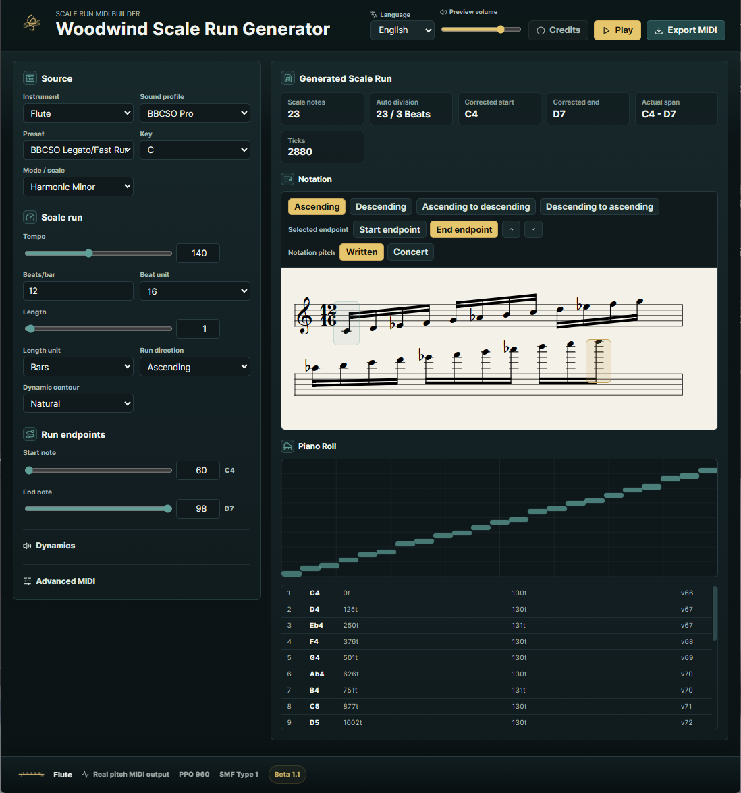

# Woodwind Scale Run Generator β1.1

Woodwind Scale Run Generator is a browser-based MIDI production helper for creating simple woodwind scale runs. It generates ascending, descending, and turn-around scale phrases between a selected start note and end note, then exports Standard MIDI Files for DAWs such as Logic Pro.

Created by Teruyuki Shiraiwa.

Live app: https://woodwind-scale-run-generator.pages.dev/

Website: https://teruyukishiraiwa.art/



## Features

- Browser-only React + TypeScript + Vite application.
- Real-pitch MIDI generation with PPQ 960.
- Standard MIDI File Type 1 export.
- Optional Program Change export with UI program numbers 1-128 converted to MIDI bytes 0-127.
- Woodwind instruments: Piccolo, Flute, Oboe, Clarinet, Bassoon, Contrabassoon.
- General MIDI, BBCSO Pro, and Custom sound profiles.
- Editable BBCSO-oriented dynamics presets.
- Velocity and enabled CC lanes use direction-aware Natural / Inverted contours with Min / Max / Curve controls.
- VexFlow notation preview with Written / Concert pitch display.
- VexFlow music font readiness is handled before initial notation rendering.
- Piano roll preview.
- Tone.js browser playback with browser-side preview volume control.
- English / Japanese UI display switch.
- Credits panel.

## β1.1 Status

This is a β1.1 public build. It is intended as a practical production aid and a foundation for further UI, notation, and workflow refinements.

The app does not provide full notation editing, MusicXML export, Web MIDI output, multi-instrument generation, or complete written-pitch key signature handling.

## Local Development

```bash
npm install
npm run dev
```

Open the local URL shown by Vite.

## Build

```bash
npm run build
```

The production build is written to `dist/`.

## Test

```bash
npm test
```

## Deployment

This repository is intended to be deployed with Cloudflare Pages using the Vite build:

- Build command: `npm run build`
- Build output directory: `dist`
- Node.js version: `20` or newer
